# MyMemoryMatch

Gra pamięciowa w trybie wieloosobowym, umożliwiająca rozgrywkę online z logowaniem, rankingiem, historią gier i odzyskiwaniem hasła.

## Spis treści
- [Opis projektu](#opis-projektu)
- [Funkcjonalności](#funkcjonalności)
- [Struktura projektu](#struktura-projektu)
- [Technologie](#technologie)
- [Instalacja](#instalacja)
- [Użytkowanie](#użytkowanie)
- [API](#api)
- [Socket.IO](#socketio)
- [Baza danych](#baza-danych)
- [Wdrożenie](#wdrożenie)
- [Bezpieczeństwo](#bezpieczeństwo)
- [Autorzy](#autorzy)

## Opis projektu
MyMemoryMatch to webowa gra pamięciowa w trybie 1v1, w której gracze dopasowują pary kart na czas. Aplikacja obsługuje rejestrację, logowanie, tworzenie i dołączanie do pokoi gry, ranking najlepszych wyników oraz historię gier. Wykorzystuje WebSocket (Socket.IO) do komunikacji w czasie rzeczywistym i jest wdrożona na platformie Azure. Interfejs jest responsywny, dostosowany do urządzeń mobilnych i desktopowych.

## Funkcjonalności
- **Uwierzytelnianie**: Rejestracja, logowanie, odzyskiwanie i resetowanie hasła przez e-mail.
- **Pokoje gry**: Tworzenie pokoi z unikalnymi kodami, dołączanie do istniejących.
- **Rozgrywka**: Gra pamięciowa z trzema poziomami trudności:
  - Łatwy: 4 pary kart.
  - Średni: 6 par kart.
  - Trudny: 8 par kart.
  - Limit czasu: 100 sekund.
- **Ranking**: Wyświetlanie 10 najlepszych wyników, obliczanych jako `matches * (100 - time_played)`.
- **Historia gier**: Przeglądanie szczegółów poprzednich gier (przeciwnik, poziom trudności, liczba dopasowań, czas gry, liczba odwróceń).
- **Responsywność**: Interfejs dostosowany do różnych rozdzielczości (desktop, tablet, smartfon).
- **Powiadomienia**: Wyświetlanie komunikatów o błędach lub sukcesach (np. potwierdzenie rejestracji).

## Struktura projektu

```mermaid
graph TD
    A[my-klik-app] --> B[public]
    A --> C[routes]
    A --> D[certs]
    A --> E[server.js]
    A --> F[db.js]
    A --> G[dbConfig.js]
    A --> H[package.json]
    A --> I[.env]
    A --> J[main_my-klik-app.yml]
    B --> B1[index.html]
    B --> B2[menu.html]
    B --> B3[game2.html]
    B --> B4[recovery_passwd.html]
    B --> B5[reset-password.html]
    B --> B6[login_main.css]
    B --> B7[menu_main.css]
    B --> B8[styles.css]
    B --> B9[recovery_main.css]
    B --> B10[index.js]
    B --> B11[menu.js]
    B --> B12[game2.js]
    B --> B13[recovery.js]
    B --> B14[reset.js]
    B --> B15[script.js]
    C --> C1[auth.js]
    C --> C2[leaderboard.js]
    C --> C3[room.js]
    D --> D1[DigiCertGlobalRootCA.crt.pem]
```


### Opis plików
- **public/**: Zawiera zasoby frontendowe:
  - `index.html`: Strona logowania i rejestracji.
  - `menu.html`: Menu gry (tworzenie/dołączanie do pokoju, ranking, historia).
  - `game2.html`: Interfejs gry wieloosobowej.
  - `recovery_passwd.html`: Formularz odzyskiwania hasła.
  - `reset-password.html`: Formularz resetowania hasła.
  - `login_main.css`: Style dla logowania/rejestracji.
  - `menu_main.css`: Style dla menu gry.
  - `styles.css`: Style dla rozgrywki.
  - `recovery_main.css`: Style dla odzyskiwania hasła.
  - `index.js`: Obsługa logowania/rejestracji.
  - `menu.js`: Obsługa menu gry.
  - `game2.js`: Logika gry wieloosobowej (Socket.IO).
  - `recovery.js`: Obsługa odzyskiwania hasła.
  - `reset.js`: Obsługa resetowania hasła.
  - `script.js`: Mechanika gry (logika kart, WebSocket).
- **routes/**: Moduły API Express:
  - `auth.js`: Trasy uwierzytelniania.
  - `leaderboard.js`: Trasa rankingu.
  - `room.js`: Trasy zarządzania pokojami.
- **certs/**: Certyfikat SSL dla Azure (`DigiCertGlobalRootCA.crt.pem`).
- **server.js**: Główny serwer Express i Socket.IO.
- **db.js**: Pula połączeń MySQL z promisami.
- **dbConfig.js**: Konfiguracja połączenia z bazą danych.
- **package.json**: Zależności i skrypty projektu.
- **.env**: Zmienne środowiskowe (`DB_HOST`, `DB_USER`, `DB_PASSWORD`, `DB_NAME`, `EMAIL_USER`, `EMAIL_PASS`).
- **main_my-klik-app.yml**: Konfiguracja CI/CD dla Azure.

## Technologie
- **Frontend**: HTML5, CSS3, JavaScript (ES6+)
- **Backend**: Node.js 22.x, Express 4.21.2
- **Baza danych**: MySQL (MariaDB 10.4.32)
- **Komunikacja**:
  - Socket.IO 4.8.1 (rozgrywka w czasie rzeczywistym).
  - REST API (Express).
- **Zabezpieczenia**:
  - bcrypt 5.1.0 (hashowanie haseł).
  - csurf 1.11.0 (ochrona CSRF).
  - express-rate-limit 7.5.0 (ograniczenie żądań).
- **E-mail**: nodemailer 7.0.3 (resetowanie hasła).
- **Sesje**: express-session 1.18.1, express-mysql-session 3.0.3.
- **Wdrożenie**: Azure Web App
- **CI/CD**: GitHub Actions
- **Inne**: dotenv 16.4.7, mysql2 3.14.0, react-toastify 11.0.5

## Instalacja
1. Sklonuj repozytorium:
   ```bash
   git clone <repo-url>
   ```
2. Zainstaluj zależności:
   ```bash
   npm install
   ```
3. Skonfiguruj zmienne środowiskowe w pliku `.env`:
   ```plaintext
   DB_HOST=<mysql-host>              # np. nazwa-serwera.mysql.database.azure.com
   DB_USER=<mysql-user>              # np. nazwa-uzytkownika@nazwa-serwera
   DB_PASSWORD=<mysql-password>
   DB_NAME=gra1v1
   EMAIL_USER=<email-address>
   EMAIL_PASS=<email-password>
   ```
4. Skopiuj certyfikat SSL do `certs/DigiCertGlobalRootCA.crt.pem` (dostępny w dokumentacji Azure).
5. Uruchom serwer:
   ```bash
   npm start
   ```

**Wymagania systemowe**:
- Node.js 22.x
- MySQL/MariaDB 10.4+
- Przeglądarka: Chrome, Firefox, Safari (najnowsze wersje)

## Użytkowanie
1. Otwórz przeglądarkę i przejdź do `http://localhost:8080`.
2. Zarejestruj się (podaj nazwę użytkownika, e-mail, hasło) lub zaloguj.
3. W menu głównym:
   - Stwórz pokój, wybierając poziom trudności (łatwy, średni, trudny).
   - Dołącz do istniejącego pokoju, wpisując kod.
4. Rozegraj grę, dopasowując pary kart szybciej niż przeciwnik (limit 100 sekund).
5. Sprawdź wyniki w rankingu (top 10) lub historii gier (ostatnie gry).

**Uwagi**:
- Gra wymaga połączenia dwóch graczy w pokoju.
- Po upływie czasu wyniki są porównywane (wygrana, przegrana, remis).
- W przypadku rozłączenia przeciwnika gra się kończy.

## API
Wszystkie żądania POST wymagają tokenu CSRF (pobieranego przez `GET /auth/csrf-token`).

### Uwierzytelnianie (`/auth`)
- **POST /auth/register**
  - **Body**: `{ username: string, email: string, password: string }`
  - **Odpowiedź**: `{ success: true }` lub `{ error: string }`
  - Rejestruje nowego użytkownika (username: 3-50 znaków, email: poprawny format, password: min. 8 znaków).
- **POST /auth/login**
  - **Body**: `{ username: string, password: string }`
  - **Odpowiedź**: `{ success: true, username: string }` lub `{ error: string }`
  - Loguje użytkownika, zapisuje sesję.
- **POST /auth/forgot-password**
  - **Body**: `{ email: string }`
  - **Odpowiedź**: `{ success: true }` lub `{ error: string }`
  - Wysyła e-mail z linkiem do resetu hasła.
- **POST /auth/reset-password**
  - **Body**: `{ token: string, newPassword: string }`
  - **Odpowiedź**: `{ success: true }` lub `{ error: string }`
  - Resetuje hasło dla podanego tokenu.
- **POST /auth/logout**
  - **Odpowiedź**: `{ success: true }`
  - Usuwa sesję użytkownika.
- **GET /auth/csrf-token**
  - **Odpowiedź**: `{ csrfToken: string }`
  - Zwraca token CSRF dla żądań POST.

### Pokoje (`/room`)
- **POST /room/create**
  - **Body**: `{ difficulty: string }`
  - **Odpowiedź**: `{ success: true, roomCode: string }` lub `{ error: string }`
  - Tworzy nowy pokój, wymaga zalogowania.
- **POST /room/join**
  - **Body**: `{ code: string }`
  - **Odpowiedź**: `{ success: true }` lub `{ error: string }`
  - Dołącza do pokoju o podanym kodzie.

### Ranking (`/leaderboard`)
- **GET /leaderboard**
  - **Odpowiedź**: `{ leaderboard: [{ username: string, score: number, matches: number, time_played: number, flips: number, difficulty: string }] }`
  - Zwraca 10 najlepszych wyników.

### Gra (`/game`)
- **POST /game/save-result**
  - **Body**: `{ playerName: string, roomCode: string, flips: number, timePlayed: number, matches: number, difficulty: string, startTime: string, endTime: string }`
  - **Odpowiedź**: `{ success: true }` lub `{ error: string }`
  - Zapisuje wynik gry w bazie.
- **GET /game/last-result**
  - **Odpowiedź**: `{ found: boolean, myResult: object, opponentResult: object }`
  - Zwraca ostatni wynik gracza i przeciwnika.
- **GET /game/history**
  - **Odpowiedź**: `{ found: boolean, results: [{ id: number, player_name: string, room_id: number, flips: number, time_played: number, matches: number, difficulty: string, start_time: string, end_time: string, opponent_name: string, opponent_matches: number, opponent_flips: number, opponent_time_played: number }] }`
  - Zwraca historię gier użytkownika.

### Sesja
- **GET /session/check**
  - **Odpowiedź**: `{ loggedIn: boolean, username: string }`
  - Sprawdza, czy użytkownik jest zalogowany.

## Socket.IO
Komunikacja w czasie rzeczywistym dla rozgrywki wieloosobowej.

### Zdarzenia (nasłuchiwane przez serwer)
- **join-room**: `{ roomCode: string, difficulty: string }`
  - Gracz dołącza do pokoju.
- **click**: `{ roomCode: string, clicks: number }`
  - Gracz klika kartę.
- **player-finished**: `{ roomCode: string, playerId: string, flips: number, timePlayed: number, matches: number }`
  - Gracz kończy grę.
- **game-over**: `{ roomCode: string }`
  - Gra kończy się (np. upływ czasu).
- **disconnect**
  - Gracz rozłącza się z pokoju.

### Emisje (wysyłane do klienta)
- **room-created**: `{ roomCode: string, difficulty: string }`
  - Potwierdzenie stworzenia pokoju.
- **game-start**: `{ difficulty: string }`
  - Rozpoczęcie gry (dwóch graczy w pokoju).
- **opponent-info**: `{ opponentName: string }`
  - Informacje o przeciwniku.
- **time-update**: `{ timeRemaining: number }`
  - Aktualizacja pozostałego czasu.
- **opponent-clicked**: `{ clicks: number }`
  - Kliknięcie karty przez przeciwnika.
- **your-results**: `{ flips: number, timePlayed: number, matches: number, isWinner: boolean }`
  - Wyniki gracza po zakończeniu gry.
- **time-up-results**: `{ status: string }`
  - Wyniki po upływie czasu (wygrana, przegrana, remis).
- **opponent-disconnected**
  - Przeciwnik rozłączył się.
- **game-ended**
  - Gra zakończona.
- **kicked**
  - Gracz wyrzucony z pokoju.
- **error**: `{ message: string }`
  - Komunikat błędu.

## Baza danych
Baza danych `gra1v1` (MySQL/MariaDB) zawiera trzy tabele:

### users
| Pole              | Typ               | Opis                        |
|-------------------|-------------------|-----------------------------|
| id                | INT, PK, AI       | Unikalne ID użytkownika     |
| username          | VARCHAR(50), UNIQ | Nazwa użytkownika           |
| password          | VARCHAR(255)      | Hash hasła (bcrypt)         |
| email             | VARCHAR(100)      | Adres e-mail                |
| reset_token       | VARCHAR(255)      | Token resetu hasła          |
| reset_token_expiry| DATETIME          | Ważność tokenu              |

### rooms
| Pole        | Typ               | Opis                        |
|-------------|-------------------|-----------------------------|
| id          | INT, PK, AI       | Unikalne ID pokoju          |
| code        | VARCHAR(10), UNIQ | Kod pokoju (np. 'R6QY5W')   |
| player1_id  | INT               | ID pierwszego gracza        |
| player2_id  | INT               | ID drugiego gracza (opcjonalne) |
| created_at  | TIMESTAMP         | Czas utworzenia             |

### results
| Pole        | Typ               | Opis                        |
|-------------|-------------------|-----------------------------|
| id          | INT, PK, AI       | Unikalne ID wyniku          |
| player_name | VARCHAR(255)      | Nazwa gracza                |
| room_id     | INT, FK           | ID pokoju (relacja z rooms) |
| flips       | INT               | Liczba odwróceń kart        |
| time_played | INT               | Czas gry (sekundy)          |
| matches     | INT               | Liczba dopasowań            |
| difficulty  | ENUM('easy','medium','hard') | Poziom trudności |
| start_time  | DATETIME          | Czas rozpoczęcia gry        |
| end_time    | DATETIME          | Czas zakończenia gry        |

**Relacje**:
- `results.room_id` → `rooms.id` (klucz obcy).

**Uwagi**:
- Tabela `sessions` jest tworzona automatycznie przez `express-mysql-session` do przechowywania sesji użytkowników.
- Kod SQL bazy: patrz `gra1v1NEW.sql`.

## Wdrożenie
Aplikacja jest wdrożona na Azure Web App pod adresem:  
`https://my-klik-app-e9f0fcd4hhe4atbn.westeurope-01.azurewebsites.net`.

### Konfiguracja
- **Zmienne środowiskowe**: Skonfigurowane w panelu Azure (`DB_HOST`, `DB_USER`, `DB_PASSWORD`, `DB_NAME`, `EMAIL_USER`, `EMAIL_PASS`).
- **SSL**: Połączenie z bazą MySQL używa certyfikatu `DigiCertGlobalRootCA.crt.pem`.
- **Port**: Domyślnie 8080 (konfigurowalny w Azure).

### CI/CD
Proces CI/CD jest zdefiniowany w pliku `main_my-klik-app.yml` (GitHub Actions):
- **Wyzwalacze**: Push do gałęzi `main` lub ręczne uruchomienie.
- **Budowanie**:
  - Środowisko: Ubuntu, Node.js 22.x.
  - Kroki: `npm install`, opcjonalne `npm run build` i `npm run test`.
  - Tworzenie artefaktu ZIP (`release.zip`).
- **Wdrożenie**:
  - Pobieranie artefaktu.
  - Logowanie do Azure (używając Client ID, Tenant ID, Subscription ID).
  - Wdrożenie do slotu produkcyjnego aplikacji `my-klik-app`.

## Bezpieczeństwo
- **CSRF**: Tokeny CSRF dla wszystkich żądań POST (`csurf`).
- **Hasła**: Hashowanie za pomocą bcrypt (10 rund).
- **Ograniczenie żądań**:
  - Logowanie: 10 prób na 15 minut.
  - Reset hasła: 5 prób na 15 minut (`express-rate-limit`).
- **Walidacja danych**:
  - Username: 3-50 znaków, tylko litery, cyfry, podkreślenia.
  - E-mail: Poprawny format (regex).
  - Hasło: Minimum 8 znaków, wielkie i małe litery, cyfry, znaki specjalne.
- **Sesje**:
  - Przechowywanie w MySQL (`express-mysql-session`).
  - Ciasteczka: `httpOnly`, `sameSite: lax`, ważność 24 godziny.
- **SSL**: Bezpieczne połączenie z bazą danych (certyfikat CA Azure).
- **Content-Security-Policy**: Ograniczenie źródeł zasobów (skrypty, style, fonty, obrazy tylko z zaufanych domen).
- **Socket.IO**: Weryfikacja sesji użytkownika przy połączeniu.

**Uwagi**:
- Sesje wygasają po 24 godzinach, z automatycznym usuwaniem.
- Linki resetu hasła są ważne przez 1 godzinę.

## Autorzy
- KL
- MF
- DA
- ŁW